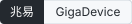
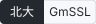

# 纲目 Gangmu：嵌入式固件 SBOM 与 CRA 合规工具

**面向嵌入式 C/C++ 的构建期 SBOM 工具，配一份社区共建的芯片 SDK 组件识别规则库。**

识别被芯片原厂改名、魔改、静态链接后的开源组件（包括国产芯片 SDK 与国密库），
生成 CycloneDX / SPDX 软件物料清单和 VEX，对照欧盟《网络弹性法案》（CRA）自查，
并起草 CRA 与工信部的漏洞报送材料。

[](https://github.com/GANGMU-SBOM/gangmu/actions/workflows/ci.yml)
[](https://pypi.org/project/gangmu-sbom/)
[](LICENSE)
[](https://github.com/GANGMU-SBOM/gangmu-rules/blob/main/rules/LICENSE)
[](pyproject.toml)
[](https://cyclonedx.org/)
[](https://spdx.dev/)

[English](README.en.md) · [规则库 gangmu-rules](https://github.com/GANGMU-SBOM/gangmu-rules) · [评测 gangmu-bench](https://github.com/GANGMU-SBOM/gangmu-bench) · [常见问题](docs/FAQ.md) · [术语表](docs/GLOSSARY.md) · [规则格式](docs/RULE-FORMAT.md) · [评测基准](docs/BENCHMARK.md) · [CRA 对标](docs/CRA.md) · [国内合规](docs/CHINA.md) · [示例产物](examples/output/) · [与同类工具对比](docs/COMPARE.md)

> **名称由来**：「纲目」取自李时珍《本草纲目》。那部书把近两千种药物按「纲」分部、按「目」列种，
> 每一味都写明出处、形态与性味，后世才能辨认、比对、追溯。
> 固件里的第三方代码需要的正是这件事：被改了名、换了位置的组件，也要能认出它是哪个上游项目的哪个版本，
> 并且每一条结论都附上可以复核的证据。

---

## 先看一个例子

拿一份真实的 GmSSL 3.0.0，照着芯片原厂 SDK 的常见做法处理一遍：

- 改名：目录换成 `components/crypto_sm`；
- 删掉版本头文件 `include/gmssl/version.h`；
- 把三分之一源文件里的 `sm3_` / `sm4_` 前缀改成 `vendor_sm3_` / `vendor_sm4_`；
- 往这些文件里塞进厂商自己的函数；
- 再删掉 8 个源文件。

然后问 gangmu 这是什么：

```
$ gangmu scan firmware/ --format table
CONF  COMPONENT  VERSION  SRC        DIRECTORY             NOTES
----  ---------  -------  ---------  --------------------  ---------------
0.88  GmSSL      3.0.0    functions  components/crypto_sm  vendor-modified

  - 1280 of 1508 functions of GmSSL 3.0.0 are present (0.849 containment, strong)
  - 758 version-discriminating function(s) matched; 758 are in 3.0.0 (agreement 0.85);
    35 function(s) match no recorded version at all (vendor additions, ...)
```

名字对，版本对，并且明确标出这是**被厂商改过的副本**，不是上游原版。
上面每一行都可以复现：`./examples/disguise.sh`。

这就是嵌入式 SBOM 的真实难点，也是这个项目要解决的问题。

## 为什么 C/C++ 嵌入式的 SBOM 做不好

Python、JavaScript、Go、Rust 都有锁文件，生成 SBOM 基本就是读文件。嵌入式 C/C++
没有，而且还会再抹掉四层证据：

1. **没有包管理器**，第三方源码直接拷进工程；
2. **芯片原厂改名魔改**，ESP-IDF 里的 lwIP 是乐鑫的分支，不是上游 2.2.0；
3. **全部静态链接**，产物里没有任何依赖信息；
4. **编译的远多于出货的**，源码树里有、链接时被丢掉的代码比比皆是。

只扫源码树会**多报**，只分析二进制会**少报**。gangmu 读的是**构建过程**：
`compile_commands.json` 说明编译了什么，链接 map 说明最终留下了什么，
组件身份则对照一份任何人都能贡献的外部规则库来判定。

## 关键数字

除标注「需商业版规则包」的行外，全部可以用仓库里的工具复现，方法和数据见 [docs/BENCHMARK.md](docs/BENCHMARK.md) 与 [docs/PERFORMANCE.md](docs/PERFORMANCE.md)。

| 指标 | 结果 |
| --- | --- |
| 区分「厂商 fork」与「换了个版本」 | 目录级相似度只差 **0.06**；函数级拉开到 **0.25**（四倍） |
| 真实 lwIP 发布版的版本识别 | **6/6 精确**（其中乐鑫生产 fork 一行需商业版规则包） |
| 合成厂商修改下的识别 | **9/9 识别、9/9 版本正确**（改名、删文件、加代码、重排版） |
| 重命名 10% 标识符后的保留率 | 精确哈希 0.480 → 抽象层 **0.876** |
| SBOM 最小要素 | NTIA 2021 与 CISA 2026 均 **10.0 / 10** |
| 匹配开销 | 函数集比 winnowing 指纹小 **54 倍**，0.28 s vs 0.59 s |
| 整棵 ESP-IDF v5.4.2（10,767 个源文件；含商业版乐鑫规则包） | 单进程 72.5 s → **11.0 s**，内存 366 → 123 MB；4 进程再扫一遍 **2.1 s** |
| 规则数增加 16 倍（27 → 432 条，含商业版规则包） | 扫描耗时只增加约 2 倍：3.2 s → 6.8 s |
| 国产 SDK 里的 RTOS 内核 | 7 个 SDK 中 **14/14** 份 FreeRTOS / RT-Thread 副本全部找到，版本全对或区间包含真值 |
| 读完整 NVD 镜像做漏洞比对 | 200.8 s / 3.9 GB → **8.9 s / 25 MB**，结果逐条一致 |

为什么换到函数级：一个厂商 fork 往往**同时包含多个上游版本的函数**。
在整棵树的相似度上，它恰好落在两个相邻版本之间，任何阈值都分不开；
在函数级上，版本来自「这些函数属于哪几个发布版」，而不是来自一个距离。
算法参考 CENTRIS（ICSE 2021）与 TIVER（ICSE 2025），细节见
[docs/ALGORITHMS.md](docs/ALGORITHMS.md)。

## 快速上手

需要 Python 3.9+。

```bash
pip install gangmu-sbom      # 或 pipx install gangmu-sbom；加 [fast] 启用可选 numpy，结果逐值一致（会一并装上规则库 gangmu-rules）
gangmu init          # 生成 gangmu.yaml：产品名、制造商、销售市场、支持期限
```

必填项填一次，之后所有命令都读这份配置。CI 和开发机产出同一份文档，
没有人需要在凌晨两点把产品版本号手打进报送表单。

### 生成 SBOM

```bash
# 只看源码树（会多报）
gangmu scan ~/esp/my-project

# 结合构建事实（推荐）
gangmu scan ~/esp/my-project \
    --compile-db build/compile_commands.json \
    --link-map   build/my-project.map \
    --format cyclonedx -o sbom.json

# 没有 compile_commands.json：读 IDE 工程，或者旁观一次真实构建
gangmu scan ~/proj --project app.ewp --configuration Release   # IAR / Keil / CCS
gangmu wrap -o compile_commands.json -- make -j8

# 只有 sdkconfig 或 Zephyr 的 .config：配置里关掉的组件不进 SBOM（自动读取根目录或 build/ 下的，
# 也可以用 --kconfig 指定；只对规则里声明了 config_symbols 的组件生效，配置没提到的选项不会删掉任何东西）
gangmu scan ~/esp/my-project --kconfig sdkconfig
```

```
build facts: {'compiled': 19, 'linked': 17, 'droppedAtLink': 2, 'ambiguousObjects': 0}

CONF  COMPONENT  VERSION  SRC     DIRECTORY                NOTES
----  ---------  -------  ------  -----------------------  ---------------
0.95  cJSON      1.7.19   anchor  components/json/cJSON
0.95  cJSON      1.7.19   anchor  components/legacy/cJSON  not linked
0.95  lwIP       2.2.0    anchor  components/lwip/lwip     vendor-modified

1 candidate director(ies) unidentified: components/lwip
```

这段输出里有三件事是只扫源码的工具做不到的：

- **`not linked`**：这份 cJSON 编译过，但链接时被丢掉了。写进 SBOM，就要白白追它三年的 CVE。
- **`vendor-modified`**：ESP-IDF 带的是乐鑫的 lwIP 分支。SBOM 在 `pedigree` 里如实写明祖先版本和厂商补丁。
- **`unidentified`**：有个目录像组件，但没有规则认得它。明确告诉你，比悄悄漏掉有用得多。

许可证以规则里记录的上游许可证为准；同时读组件目录里的 `SPDX-License-Identifier` 文件头和顶层 LICENSE / COPYING，
看到规则没提的许可证时，在 SBOM 里加 `gangmu:observedLicenses` 和 `gangmu:licenseDiffersFromRule` 两个属性，不替你选。
规则没有许可证的组件，用目录里自己声明的。LICENSE 文本只认 Apache-2.0、MIT、BSD、ISC、Zlib、MPL-2.0、BSL-1.0 这几种措辞明确的，
GPL 类只信 SPDX 文件头。`--no-licenses` 关闭。

### 在 CI 里用

GitHub Action 已上架 [GitHub Marketplace](https://github.com/marketplace/actions/gangmu-sbom)。

```yaml
# GitHub Actions
- uses: GANGMU-SBOM/gangmu@v0
  with:
    compile-db: build/compile_commands.json
    link-map: build/my-project.map
    app-name: my-firmware
    app-version: ${{ github.ref_name }}
    output: sbom.cdx.json
```

```yaml
# .pre-commit-config.yaml
- repo: https://github.com/GANGMU-SBOM/gangmu
  rev: v0.6.2
  hooks:
    - id: gangmu-scan
```

### 漏洞比对与合规

```bash
gangmu vuln-fetch --db advisories/ --sbom sbom.json    # 有网的机器上：只拉这份 SBOM 用得到的 NVD / OSV 记录
gangmu vuln sbom.json --db advisories/ -o vex.json     # NVD / OSV 本地镜像（可直接用 .json.xz 全量库），输出 CycloneDX VEX
gangmu vuln sbom.json --db advisories/ --cn-db cnnvd/  # 加上国内漏洞库通道
gangmu cra-check --sbom sbom.json --vex vex.json       # 逐条对照 CRA，有阻塞缺口时返回非零
gangmu evidence --out cra-evidence/                    # 十年留存的技术文档包
```

漏洞暴露后：

```bash
# 欧盟 CRA 第 14 条：24 小时预警草稿
gangmu report CVE-2027-12345 --stage early-warning --vex vex.json \
    --aware-at 2027-05-14T08:12Z -o 24h-draft.md

# 工信部《网络产品安全漏洞管理规定》第七条：2 日内报送的中文草稿
gangmu report CVE-2027-12345 --regime cn-miit --vex vex.json \
    --aware-at "2027-05-14 08:12" --scope "全系列，出货约 4.2 万台"
```

缺的字段明确标 `MISSING`，绝不编造。

多个产品型号、多条时限需要团队协作跟踪时，可以使用[商业版的报送工作台](docs/EDITIONS.md)。

## 能识别什么

| 类别 | 例子 | 怎么认 |
| --- | --- | --- |
| 通用开源组件 | lwIP、Mbed TLS、FreeRTOS、RT-Thread、LVGL、OpenSSL、littlefs、FatFs、libcoap、nghttp2 等 | 目录定位 + 函数级指纹，版本来自「这些函数属于哪几个发布版」 |
| 国密库 | GmSSL 2.x / 3.x、铜锁 Tongsuo | 逐版本锚点 + 多版本函数签名 + 版本探针；与 OpenSSL 互相做代码分割，不会互相误认 |
| 包管理器与生态声明 | RT-Thread、OpenHarmony、Yocto、Buildroot / OpenWrt、PlatformIO、Conan、Bazel、Zephyr `module.yml` | 直接读声明，声明与代码不一致时以代码为准，并把分歧写进证据 |
| Zephyr 及其 HAL | Mbed TLS、hostap、MCUboot、nanopb，以及博流、沁恒、思澈、泰凌微、瑞昱、兆易的 HAL | 从 Zephyr 的锁定提交直接生成规则 |
| 国产 SDK 里的内核与第三方库 | FreeRTOS / RT-Thread / LiteOS / TencentOS-tiny / AliOS Things 内核，FreeType、Opus 等 | 标志文件定位，不依赖目录名 |

各家国产生态具体覆盖了什么、没覆盖什么，见 [docs/CHINA.md](docs/CHINA.md)；每个版本新增了什么，见 [docs/CHANGELOG.md](docs/CHANGELOG.md)。


## 规则库才是核心

生成器一个周末就能重写；「哪个目录是哪个上游的哪个版本」是数据，只能靠很多人一起积累。
所以规则放在单独的仓库 [gangmu-rules](https://github.com/GANGMU-SBOM/gangmu-rules)，用更宽松的 CDLA-Permissive-2.0 授权，任何项目和产品都能直接使用。
规则按日期独立发布，`pip install -U gangmu-rules` 就能拿到新规则，不用等工具发版。
自有 BSP 或未公开 SDK 的规则可以放在自己的目录里，用多个 `--rules` 叠加在社区规则之上。

规则分两部分：免费的 gangmu-rules 放被各家 SDK 拷贝最多的通用开源组件、Zephyr 及其 HAL 模块和社区贡献的规则；
只跟某一家公司绑定的规则（这家公司自己的 SDK、固件库，或它 fork 过的开源组件）属于商业版规则包，需要请联系我们（见文末）。规则 id 两边一致，装上商业版规则包后自动叠加。

一条规则的贡献和审核成本都接近于零：

```bash
# 从一个干净的上游发布版生成识别块
gangmu rules fingerprint cJSON --version 1.7.19 \
    --include 'cJSON.c' --include 'cJSON.h' --anchor cJSON.h

# 或者从 SDK 自己的锁定信息批量导入（在 gangmu-rules 的检出目录里运行）
gangmu rules import https://github.com/espressif/esp-idf \
    --vendor espressif --sdk esp-idf --out rules/espressif/esp-idf/
```

向 [gangmu-rules](https://github.com/GANGMU-SBOM/gangmu-rules) 提交 PR 后，CI 会克隆规则声明的那个上游版本，把所有证据重新算一遍：

```
$ gangmu rules verify --rule generic/gmssl
ok   generic/gmssl
       + anchor include/gmssl/version.h matches 3.2.0
       + fileset hash reproduces exactly (190 files)
       + signature reproduces exactly (similarity 1.0000)
       + probe on include/gmssl/version.h yields 3.2.0
```

对不上就直接拒绝，并给出差异。第一条 cJSON 规则就是这样被拦下的：
用仓库 HEAD 取指纹却声称是 v1.7.19，相似度 0.9922，期望 1.0。

**规则库不猜 CPE。** 免费规则库 60 条里有 29 条带 CPE。新加的 CPE 都附有 NVD 里的 CVE 作为证据（`cpe_evidence`）。另外 31 条没有 CPE，每条都写明原因，多数是在完整的 NVD 镜像里确实查无记录。
写错一个字的 CPE 匹配不到任何 CVE，SBOM 看起来却是干净的，这是规则出错最昂贵的方式。
所以 PURL / OSV 是一等通道，不是兜底。

当前覆盖：

| 来源 | 组件 |
| --- | --- |
| 通用 | lwIP、cJSON、OpenSSL、GmSSL（3.x 与 2.x）、铜锁、FreeRTOS 内核、RT-Thread 内核、TencentOS-tiny 内核、AliOS Things 内核、LiteOS-M / LiteOS-A / LiteOS 5.x 内核、Mbed TLS、TF-PSA-Crypto、FatFs、littlefs、LVGL、libcoap、TinyCrypt、nghttp2、libwebsockets、Paho MQTT C、OpenThread、AWS IoT Device SDK |
| Zephyr | Mbed TLS 4.1、TF-PSA-Crypto、hostap、FatFs、littlefs、MCUboot、nanopb、zcbor、uOSCORE/uEDHOC |
| 国产与亚太芯片 HAL | 兆易、博流、沁恒、思澈、泰凌微、瑞昱 |

覆盖的国产厂商与项目（含商业版规则包；规则或 SDK 识别至少有一项，覆盖深度各不相同）：

<p>                  </p>

这些是文字标识，不是厂商 logo；仓库里没有放任何厂商的图形标志，因为没有逐家核对它们的品牌使用条款。
各家具体覆盖了什么，见 [docs/CHINA.md](docs/CHINA.md)。

贡献规则见 [gangmu-rules 的贡献指南](https://github.com/GANGMU-SBOM/gangmu-rules/blob/main/CONTRIBUTING.md) 与 [docs/RULE-FORMAT.md](docs/RULE-FORMAT.md)；改工具本身见 [CONTRIBUTING.md](CONTRIBUTING.md)。

## 两套报送义务

对出口欧盟的国内厂商，CRA 不是唯一的报送义务，也不是触发最频繁的那个。

| | 《网络产品安全漏洞管理规定》第七条 | CRA 第 14 条 |
| --- | --- | --- |
| 触发 | **发现**漏洞 | 漏洞**被积极利用** |
| 时限 | **2 日内** | 24 小时 / 72 小时 / 14 天 |
| 平台 | 工信部 cstis.cn | ENISA 单一报告平台 |

还有一处工具不该替人下结论的张力：该规定第九条第（七）项禁止向境外组织提供未公开漏洞信息，
未设例外；而 CRA 要求 24 小时内向 ENISA 报送未公开漏洞。gangmu 在生成欧盟草稿时
就把这一点摆出来，明确说明这是法务判断，而不是让团队在倒计时第 20 小时才第一次想到。
详见 [docs/CHINA.md](docs/CHINA.md)。

`gangmu cra-check` 同样克制：CRA 相关的十个条款里，有五个只会返回 partial、declared
或 out of scope。配置文件里的一个 URL 不是政策被执行的证据，扫描也不是安全测试。
详见 [docs/CRA.md](docs/CRA.md)。

## 能力边界

坦白列出来，因为缺口就是路线图。最主要的几条：

- **不做深度二进制分析**：没有源码也没有构建时，只做清单、版本横幅和函数边界等较低置信度的补充证据；
- **评测规模有限**：方法是对的，规模还不是；规则也还少，欢迎一起补；
- **`gangmu vuln` 本身不联网**：联网的一步单独做成 `gangmu vuln-fetch`，方便在内网使用；
- **编译器包装器只能拦截按名字查找的编译器**。

每一条的细节、原因和绕过办法见 [docs/LIMITS.md](docs/LIMITS.md)。

## 同类工具

详细对照表见 [docs/COMPARE.md](docs/COMPARE.md)。

[Interlynk lynkctl](https://www.interlynk.io/solutions/embedded-cpp) 是面向嵌入式 C/C++ 的闭源商业产品，
支持 STM32、Infineon、NXP 等。
[乐鑫 esp-idf-sbom](https://github.com/espressif/esp-idf-sbom) 做得很好，但只覆盖一个 SDK；
gangmu 把它的 `sbom.yml` 当作一等输入，而不是竞争对象。
ONEKEY、Finite State、Cybellum、NetRise 面向大型企业做固件二进制分析。

空着的那一块，是一份**跨厂商、社区共有的「SDK 目录 → 上游组件身份」映射**，也就是 [gangmu-rules](https://github.com/GANGMU-SBOM/gangmu-rules)。

## 命令一览

| 命令 | 作用 |
| --- | --- |
| `gangmu init` | 生成项目配置 |
| `gangmu scan ROOT` | 识别组件，输出 `cyclonedx` / `spdx` / `json` / `table` |
| `gangmu wrap -- make` | 以编译器垫片运行构建，生成编译数据库 |
| `gangmu vuln-fetch --db DIR` | 联网填充漏洞库目录：`--sbom` 只拉相关产品（秒级），`--all` 全量 NVD（按年分片，之后增量）；`--threat` 另外下载 CISA KEV 和 EPSS 到 `DIR/threat/`，`gangmu vuln` 会据此按「已被利用 → EPSS → CVSS」排序，`--fail-on kev` 遇到已被利用的漏洞就失败（Article 14 的 24 小时报送由「已被积极利用」触发） |
| `gangmu vuln SBOM --db DIR --source ROOT` | 函数级可达性：按每条 CVE 的漏洞函数（`--symbols FILE` 给出；没有就从公告文字里猜）判断它在你的源码里是「不存在 / 已定义但无人引用 / 可达」。调用图按名字、宏、函数指针表做保守的过近似，看不到二进制库和汇编，所以默认只标注；加 `--reachability-vex` 才把不存在/不可达的写成 `not_affected`（`code_not_present` / `code_not_reachable`） |
| `gangmu patch-build CVE --db DIR -o patches.json`；`gangmu vuln SBOM --db DIR --source ROOT --patches patches.json` | 补丁存在性检测：用修复提交改动过的函数（修复前、修复后各记一份函数体哈希；提交号可从 OSV 记录里读，或用 `--repo URL --fix SHA` 指定）去测你源码里的那个目录——有修复后的函数体就写成 `resolved`，仍是修复前的函数体就确认为 `exploitable`，被厂商改过的函数体（既不是修复前也不是修复后）留给人判断。魔改的 fork 只报告它所基于的版本号，版本区间匹配会让它永远停在 `in_triage`；这一项直接看代码，不看版本 |
| `gangmu rules index DIR` | 预编译规则目录，写出 `DIR/.rule-index.json`，加载时不再解析 YAML（规则越多越明显：125 条规则加载 0.67 秒 → 0.02 秒）。每条按文件哈希校验，规则改了或索引过期只会变慢，不会读错；规则包在打包时运行一次 |
| `gangmu keygen` / `gangmu sign FILE --key K` / `gangmu sign-verify FILE --pubkey P` | 给 SBOM 或证据包的 `manifest.json` 做 Ed25519 分离签名并校验（`pip install gangmu-sbom[sign]`；密钥是标准 PEM，OpenSSL 可直接验）。只证明“这把密钥签过”，不含时间戳和密钥托管；要时间戳或免密钥签名，对同一文件用 `cosign sign-blob` |
| `gangmu vuln SBOM --db DIR` | 漏洞比对，输出 CycloneDX VEX |
| `gangmu cn-db-check DIR` | 检查 CNNVD / CNVD 导出目录：每个文件能读出多少条，读不了的明确报出来 |
| `gangmu cra-check` | 对照 CRA 条款审查产物 |
| `gangmu report CVE` | 生成 CRA 或工信部报送草稿 |
| `gangmu evidence --out DIR` | 汇总十年留存技术文档包 |
| `gangmu rules lint / import [--recursive] / fingerprint / verify / functions` | 规则校验、导入、生成、复现、函数签名。`--rules` 可重复，后面的目录覆盖前面同名的规则；不写则用已安装的规则包 |
| `gangmu rules cpe-evidence --nvd DIR` | 从本地 NVD 镜像里找出组件登记用的 CPE，并列出引用其上游仓库的 CVE 作为证据 |
| `gangmu perf [--check BASELINE]` | 性能基线：规则数与耗时、内存，CI 回归检查 |
| `gangmu sbom-score` / `eval` / `bench` / `diff` | 质量评分、评测基准、性能、召回率对比 |

## 仓库

纲目由三个公开仓库组成，各自独立发版：

| 仓库 | 内容 | 许可证 |
| --- | --- | --- |
| **[gangmu](https://github.com/GANGMU-SBOM/gangmu)**（本仓库） | 识别引擎、命令行、构建期采集、SBOM 与 VEX 输出、漏洞比对、CRA 与工信部报送草稿 | Apache-2.0 |
| **[gangmu-rules](https://github.com/GANGMU-SBOM/gangmu-rules)** | 免费规则库：被各家 SDK 拷贝最多的通用开源组件、Zephyr 及其 HAL，按日期发版，`pip install -U gangmu-rules` | CDLA-Permissive-2.0 |
| **[gangmu-bench](https://github.com/GANGMU-SBOM/gangmu-bench)** | 评测基准：固定的真实上游版本和正确答案，加评分脚本，任何人都能复现 | Apache-2.0 |

商业版（规则包、持续监测、报送工作台等）不在这些仓库里，见 [docs/EDITIONS.md](docs/EDITIONS.md)。

`pip install gangmu-sbom` 会自动装上 gangmu-rules。问题提到哪里：
识别错了或缺某个 SDK 的规则，提到 gangmu-rules；扫描崩溃、命令行或输出格式的问题，提到本仓库；
想补评测用例，提到 gangmu-bench。

## 参与规则共建，联系我们

规则是这个项目最值钱的部分，也最需要大家一起积累：一条规则只需要一个干净的上游版本和一次 `gangmu rules verify`。

- **通用开源组件、Zephyr 与 HAL、国产 SDK 里常见的第三方库**：直接向 [gangmu-rules](https://github.com/GANGMU-SBOM/gangmu-rules) 提 issue 或 PR，见[贡献指南](https://github.com/GANGMU-SBOM/gangmu-rules/blob/main/CONTRIBUTING.md)；
- **想认领某个芯片 SDK、不确定规则该放哪里、手上有真实固件样本愿意帮忙验证**：先联系我，避免重复劳动，我会告诉你怎么做最省力；
- **厂商专属规则、私有 BSP、商业版规则包**：同样联系我。

联系方式：邮箱 64031875@qq.com，或扫码进「CRA 合规群」（二维码有有效期，扫不出来请发邮件）。


你贡献的规则按 gangmu-rules 的许可证（CDLA-Permissive-2.0）授权；开源仓库里已有的内容不会撤回，也不会收费。

## 商业版与服务

开源版能让一个团队完整走通一遍流程。如果需要长期运营这条流程，我们提供：

- **漏洞持续监测**：多源合并去重，按产品型号推送，VEX 判定有专人复核；
- **报送工作台**：CRA 与工信部四条时限并行跟踪，版本级 SBOM 归档，十年留存；
- **商业版规则包**：芯片原厂与厂商专属的固件库规则，按需订阅；
- **规则库企业服务**：离线镜像、有时限承诺的规则更新、为您的私有 BSP 建立私有规则；
- **私有化部署与信创适配**，以及构建接入、规则编写培训和合规流程咨询。

核心能力（识别引擎、构建期采集、SBOM 与 VEX 输出、漏洞比对、报送草稿、评测基准和免费规则库）会一直开源，
商业版以插件和规则包的形式叠加在开源版之上，不改变开源版的任何功能。两者的完整对比见 [docs/EDITIONS.md](docs/EDITIONS.md)。
技术咨询与商务合作见文末的[联系方式](#参与规则共建联系我们)，也可以提一个标题以「商业版」开头的 issue。

## 许可

- 工具（本仓库）：Apache-2.0
- 规则（[gangmu-rules](https://github.com/GANGMU-SBOM/gangmu-rules)）：CDLA-Permissive-2.0
- 商业版规则包：专有，见 [docs/EDITIONS.md](docs/EDITIONS.md)
- 评测（[gangmu-bench](https://github.com/GANGMU-SBOM/gangmu-bench)）：Apache-2.0

## 开发

```bash
git clone https://github.com/GANGMU-SBOM/gangmu-rules
pip install -e ./gangmu-rules -e ".[dev]"
pytest -q
```

评测准确率用 [gangmu-bench](https://github.com/GANGMU-SBOM/gangmu-bench)（`python bench.py`）。

测试不需要网络：大部分测试的规则在运行时从 `tests/fixtures/upstream/` 生成，顺带验证了规则的编写路径；
另有一部分测试用真实规则库扫描样例，没装 gangmu-rules 时会跳过。测试只依赖免费规则库。
